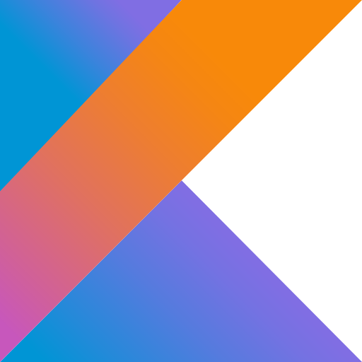
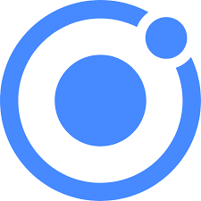
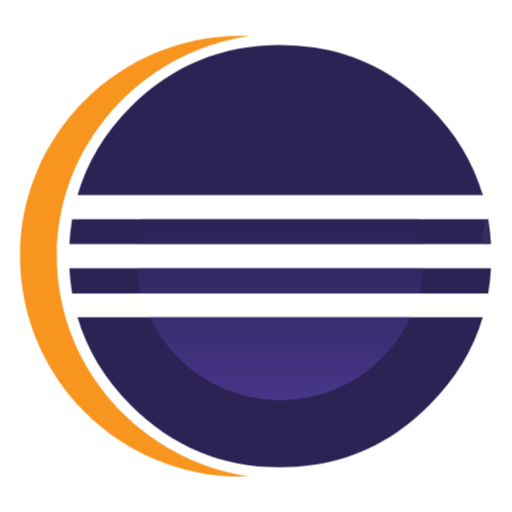

# ¡Hola! Soy Eloy Leiva López 👋🧑‍💻

Soy un desarrollador apasionado por el mundo de la tecnología.  
Mi interés se centra en la programación y en el desarrollo de aplicaciones web.

## Objetivos 2024: 🎯
* Aprender nuevos lenguajes de programación 🧠
* Desarrollar aplicaciones web ⚙
* Seguir mejorando mi inglés 📚

## Lenguajes de programación y herramientas: 🧰

  

## Sígueme: 🔎

